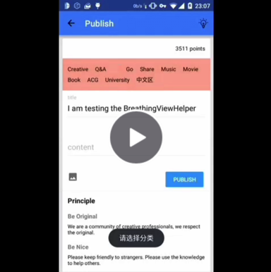

# BreathingViewHelper v1.0.0

It's a ViewHelper for setting a breathing effect background color of views.

demo:

<a href="http://weibo.com/2263023493/Cmg2jze68?type=comment" target=_blank></img></a>

## Usage
#### Step 1
##### Gradle & Maven
```groovy
dependencies {
    // I have released it but it may not update to maven center, if your maven can not find it, wait a moment please.
    compile 'me.drakeet:breathingviewhelper:1.0.0'
}
```

```xml
<dependency>
    <groupId>me.drakeet</groupId>
    <artifactId>breathingviewhelper</artifactId>
    <version>1.0.0</version>
</dependency>
```


##### Or

Import the library, then add it to your `/settings.gradle` and `/app/build.gradle`, if you don't know how to do it, you can read my blog for help.

[Android Studio 简介及导入 jar 包和第三方开源库方法](http://drakeet.me/android-studio)

#### Step 2

It's very easy:

```java
// start
BreathingViewHelper.setBreathingBackgroundColor(
                   findViewById(R.id.any_view),
                   getResources().getColor(R.color.md_red_200)
           );
// stop
BreathingViewHelper.stopBreathingBackgroundColor(findViewById(R.id.any_view));
```

all right

## key


### Customization

Temporarily not.

## THANKS


## BUG

Only for a View. It does not support multiple views at one time because it is static...

## DEMO

[apk](/sample/sample-debug.apk)

or

[贝壳单词中的发帖页面 Demo](http://www.beikedanci.com)

## About me

I am a student in China, I love reading pure literature, love Japanese culture and Hongkong music. At the same time, I am also obsessed with writing code. If you have any questions or want to make friends with me, you can write to me: drakeet.me@gmail.com

In addition, my blog: http://drakeet.me

If you like my open source projects, you can follow me: https://github.com/drakeet

License
============

    The MIT License (MIT)

    Copyright (c) 2015 drakeet

    Permission is hereby granted, free of charge, to any person obtaining a copy
    of this software and associated documentation files (the "Software"), to deal
    in the Software without restriction, including without limitation the rights
    to use, copy, modify, merge, publish, distribute, sublicense, and/or sell
    copies of the Software, and to permit persons to whom the Software is
    furnished to do so, subject to the following conditions:

    The above copyright notice and this permission notice shall be included in all
    copies or substantial portions of the Software.

    THE SOFTWARE IS PROVIDED "AS IS", WITHOUT WARRANTY OF ANY KIND, EXPRESS OR
    IMPLIED, INCLUDING BUT NOT LIMITED TO THE WARRANTIES OF MERCHANTABILITY,
    FITNESS FOR A PARTICULAR PURPOSE AND NONINFRINGEMENT. IN NO EVENT SHALL THE
    AUTHORS OR COPYRIGHT HOLDERS BE LIABLE FOR ANY CLAIM, DAMAGES OR OTHER
    LIABILITY, WHETHER IN AN ACTION OF CONTRACT, TORT OR OTHERWISE, ARISING FROM,
    OUT OF OR IN CONNECTION WITH THE SOFTWARE OR THE USE OR OTHER DEALINGS IN THE
    SOFTWARE.
